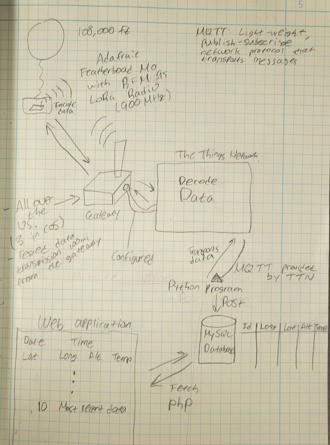

# Weather Balloon Research Project User Interface

    By Junhyung Park, C/O 25, United States Air Force Academy

    junhyung1821@gmail.com

<h2 id="subtitle" style="margin-top:2em">
    Weather Balloon Data Transmission Architecture Diagram
</h2>

      

<h2 id="subtitle" style="margin-top:2em">
    Components
</h2>

<ul>
    <li> 
        <a href="https://www.adafruit.com/product/3178">Adafruit Feather M0 with RFM95 LoRa Radio - 900MHz - RadioFruit</a>
    </li>
    <li>
        <a href="https://tektelic.com/catalog/  kona-micro-lorawan-gateway">KONA Micro IoT Gateway</a>
    </li>
    <li>
        <a href="https://www.thethingsnetwork.org/">The Things Network</a>
    </li>
    <li>
        <a href="https://store.uputronics.com/index.php?route=product/product&product_id=72">GPS: uBLOX MAX-M8C Pico Breakout with Chip Antenna</a>
    </li>
    <li>
        <a href="https://components101.com/sensors/ds18b20-temperature-sensor   ">Temperature Sensor: DS18B20</a>
    </li>
    <li>MySQL</li>
    <li>PhP Web Application</li>
</ul>

<h2 id="subtitle" style="margin-top:2em">
    Data Collection
</h2>

<ul>
    <li>Latitude</li>
    <li>Longitude</li>
    <li>Altitude</li>
    <li>Temperature</li>
</ul>

<h2 id="subtitle" style="margin-top:2em">
    Wiring Diagram
</h2>

<h2 id="subtitle" style="margin-top:2em">
    Setting Up the Gateway and The Things Network
</h2>

<ul>
    <li> 
        <a href="./Documentations/Connect_Tektelic_gateway_to_TTN_Park.pdf">How to Connect Tektelic Gateway to The Things Network</a>
    </li>
    <li> 
        <a href="./Documentations/Add_Tektelic_gateway_to_TTN_Park.pdf">How to Add Tektelic Gateway to The Things Network</a>
    </li>
    <li> 
        <a href="./Documentations/Add_application_and_end_device_to_TTN_Park.pdf">How to Add Application and End Device to The Things Network</a>
    </li>
</ul>

<h2 id="subtitle" style="margin-top:2em">
    Resources for Assembly and Programming
</h2>

     Assembly and wiring of the Feather M0 were based on  <a href="https://learn.adafruit.com/adafruit-feather-m0-radio-with-lora-radio-module/assembly">Adafruit Feather M0 Radio with LoRa Radio Module Tutorial</a>. The GPS and and temperature sensors are wired to the Feather M0 for collecting data. The temperature sensor was set up following <a href="https://randomnerdtutorials.com/guide-for-ds18b20-temperature-sensor-with-arduino/"> Guide for DS18B20 Temperature Sensor with Arduino</a>. The data transmission programming was based on <a href="https://github.com/oktavianabd/arduino-lmic"> Arduino-LMIC library documentation </a> and the example sketches provided from the library.

<h2 id="subtitle" style="margin-top:2em">
    Programming
</h2>